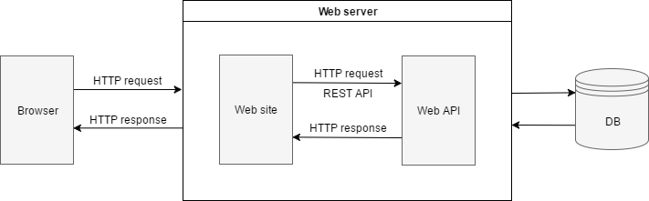
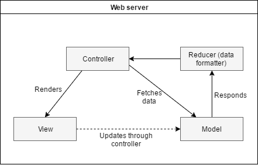
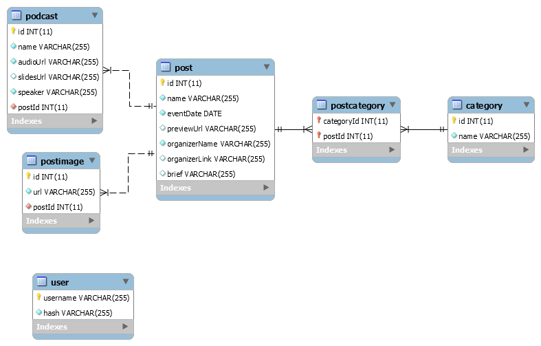

# Belka Podcasts

This is a web-site for Belka Space. The main content is audio podcasts and presentations.


# About
This repository contains Web server which serves browser version of application. API server is RESTful, it can be used to build mobile application.

# Technologies
Stack of technologies used in project:
- Backend
  - Node.js
  - Express.js
  - Handlebars as template engine
  - MySQL
  - Sequelize as ORM for MySQL
  - Epilogue as REST API generator for Sequelize
- Frontend
  - Bootstrap 4
  - jQuery

# Installation
Install packages (requires [node-gyp](https://github.com/nodejs/node-gyp) to be installed)
```
npm install
```

Run in development mode (with nodemon)
```
npm run dev
```

You need a .env file in root folder with following configuration:

```
PORT=
NODE_ENV=
SQL_DIALECT=
SQL_USERNAME=
SQL_PASSWORD=
SQL_HOST=
SQL_PORT=
SQL_DATABASE=
```

To create / drop / fill / recreate database with sample data:
```
# Create empty database
npm run db:create

# Drop existing database
npm run db:drop

# Fill database with sample data
npm run db:fill

# Drop & create & fill
npm run db:recreate

# Check connection
npm run db:test
```

No tests available yet.

# API
Posts  
`http://belka.kpi.ua/api/posts`

Podcasts  
`http://belka.kpi.ua/api/podcasts`

Categories  
`http://belka.kpi.ua/api/categories`

Posts grouped by categories  
`http://belka.kpi.ua/api/category_posts`

Post images  
`http://belka.kpi.ua/api/post_images`

All API above can be used with various query parameters for filtering, sorting, search and pagination. Look query parameters usage in [epilogue](https://github.com/dchester/epilogue#rest-api) documentation.

Posts grouped by year  
`http://belka.kpi.ua/api/annual`

# Dev
## Diagrams that represent architecture of project

#### Project architecture


#### Web server architecture


#### EER model of SQL database


## Security
[bcrypt](https://github.com/kelektiv/node.bcrypt.js) is used to hash password. Hash is stored in database.  
[express-session](https://github.com/expressjs/session) is used to keep admin session in browser.  
[express-JWT](https://github.com/auth0/express-jwt) is used to access secure API (post, put, delete requests).

## Frontend
We use [Bootstrap 4](https://v4-alpha.getbootstrap.com) to make responsive design.

Because of simplicity of frontend code, we use pure css and js without any transpilers.

### Backend
We created a small module 'fetch-data' that allows to make an HTTP request to API server to fetched certain attributes and then format them applying given functions to fetched attributes (look [R.evolve](http://ramdajs.com/docs/#evolve)).

Also created middleware 'slug' that adds [slug](https://en.wikipedia.org/wiki/Semantic_URL) at the end of id in url string. It works absolutely like on [StackOverflow](http://stackoverflow.com/).

All parts of MVC pattern realization are splitted into 2 groups - 'blog' and 'admin', that are located in self-titled folders.

----------
## Belka contacts
- [VK](https://vk.com/belka.space)
- [Facebook](https://www.facebook.com/belka.space.kpi)
- [Telegram](https://t.me/belka_space)
- [Instagram](https://www.instagram.com/belka.space)

----------
## Links
- Backend by [Vlad Khitev](https://vk.com/id18315550)
- Frontend by [Ivan Romanchuk](https://vk.com/irmchk)

© NTUU "KPI" 2017
